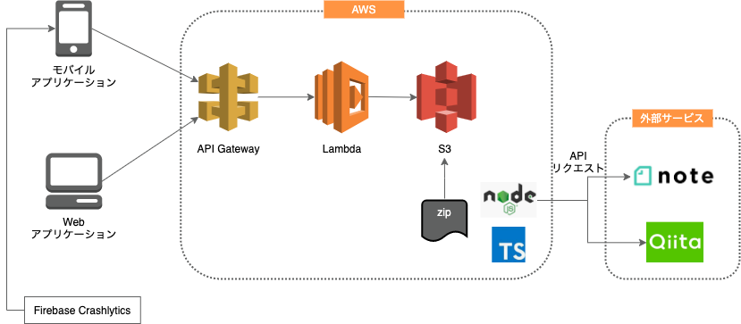

# article-collection-architecture

## アーキテクチャ図
* AWSを採用し、API Gatewayを通じてLambda関数を呼び出すサーバレスアーキテクチャを採用
  * AWSを採用した理由
    * 学習コストが低かったため
  * サーバレスアーキテクチャを採用した理由
    * 記事の取得というアプリの要件上、何度もAPIをリクエストする必要はないため、リクエスト数は少ないと考えられる。そのため、常に起動する用のEC2を立てるのではなく、リクエスト数やリクエスト時間で費用が決定するLambdaの方が費用が安く済むと考えた

## API設計
* OpenAPIで設計書を作成した
* モックサーバを立てることができる
* 現在のところAPIは1つのみ存在

### APIのIF仕様書
* [こちら](https://kamimi01.github.io/article-collection-architecture/dist/index.html)のページで公開中

### API処理機能記述
* PlantUMLでシーケンス図として作成した（非公開）

### モックサーバの起動方法
1. `open-api`のフォルダで、`npm install`する
2. `npm start`して、`http://localhost:8080/docs`にアクセスする

### APIドキュメントのモックサーバ再作成方法
1. dockerコンテナを起動する

   `docker run -d -p 80:8080 swaggerapi/swagger-editor`

1. `http://localhost`にブラウザでアクセスする
2. `Generate Server`を押して、`nodejs-server`を選択する
3. `open-api`のフォルダとして配置する# article-collection-architecture
